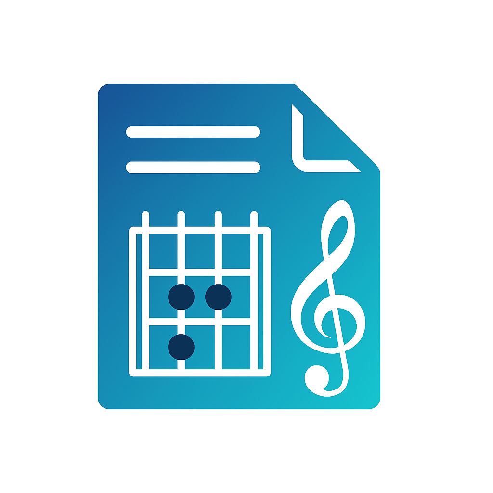

# ChordLibre

  

A PDF chord chart manager for live performance.

## What it does

Import PDF chord charts, organize them into setlists, and perform with a clean interface designed for stage use.

## Features

- PDF import via share sheet or direct file access
- Setlist creation and management  
- Performance mode with auto-scroll and tap navigation
- Configurable display settings (fit modes, contrast, page numbers)
- Keep screen awake during performance
- Core Data persistence

## Requirements

- iOS 18.0+
- Xcode 16.1+ 
- Swift 5.9+

## Building

1. Clone the repo
2. Open `ChordLibre.xcodeproj`  
3. Build and run

The app includes a share extension for importing PDFs from other apps.

## License

Apache 2.0 - see LICENSE file

---

Built with SwiftUI and Core Data.
